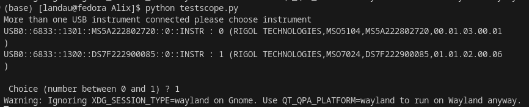
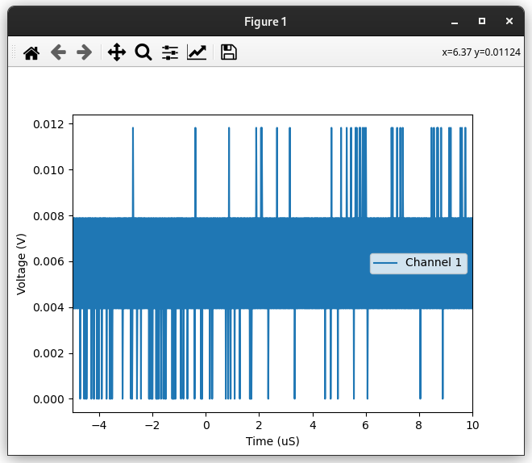

# ScopeInterface
Python interface for oscilloscopes comminicating via SCPI commands through `PyVisa`. USB or TCPIP or anything.

## PyVisa install

You need to install PyVisa and PyVisa-py in order for this software to work on any platform !

Both can be readily `pip` / `conda` / `mamba` installed.

The package names are `pyvisa` and `pyvisa-py`.

- https://pyvisa.readthedocs.io/en/latest/
- https://pyvisa.readthedocs.io/projects/pyvisa-py/en/latest/index.html

## Usage

If you don't know the adress of your device, you can just instantiate an object and you will get a prompt to chose between the detected devices (if any are detected):
```python
from ScopeInterface import USBScope
scope = USBScope()
scope.get_waveform(channels = [1],plot=True)
scope.close()
```


This will yield a plot of the displayed signal:



You can also choose to directly connect to the scope through its adress:

```þython
from ScopeInterface import USBScope
scope = USBScope('USB0::6833::1300::DS7F222900085::0::INSTR')  
scope.get_waveform(channels = [1],plot=True)
scope.close()
```

Note that if you use the TCP/IP interface, the prefix of the adress will change to reflect the interface you're using.
